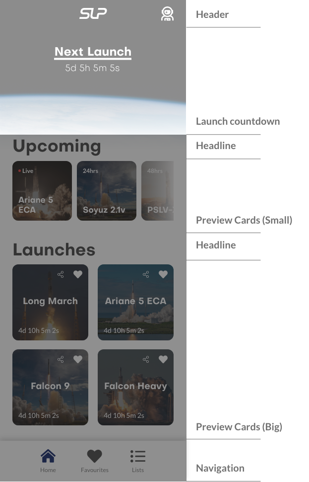
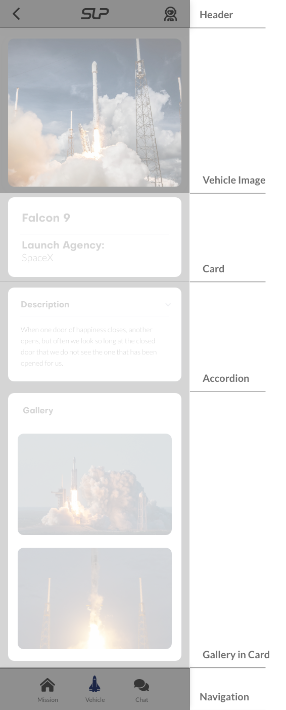
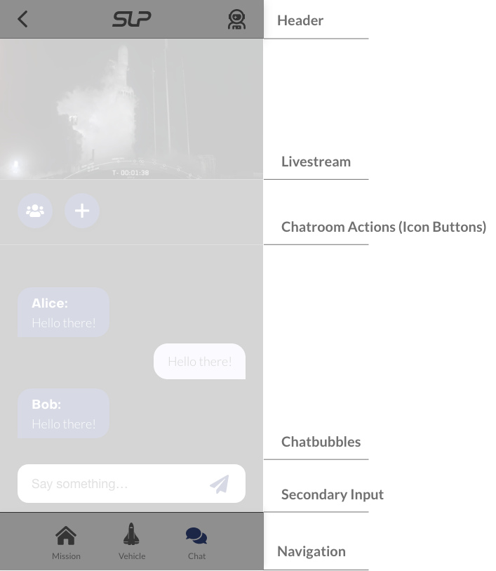

# Layouts

We are using the bootstrap grid system, which consists of 12 columns, but it also can be used without setting the specific column (flex-box).

<!-- Stack the columns on mobile by making one full-width and the other half-width -->
<div class="row margin-top-40">
  <div class="layout-bootstrap-grid col-12 col-md-8">.col-12 .col-md-8</div>
  <div class="layout-bootstrap-grid col-6 col-md-4">.col-6 .col-md-4</div>
</div>

<!-- Columns start at 50% wide on mobile and bump up to 33.3% wide on desktop -->
<div class="row">
  <div class="layout-bootstrap-grid col-6 col-md-4">.col-6 .col-md-4</div>
  <div class="layout-bootstrap-grid col-6 col-md-4">.col-6 .col-md-4</div>
  <div class="layout-bootstrap-grid col-6 col-md-4">.col-6 .col-md-4</div>
</div>

<!-- Columns are always 50% wide, on mobile and desktop -->
<div class="row margin-bottom-40">
  <div class="layout-bootstrap-grid col-6">.col-6</div>
  <div class="layout-bootstrap-grid col-6">.col-6</div>
</div>

```html
<!-- Stack the columns on mobile by making one full-width and the other half-width -->
<div class="row">
  <div class="layout-bootstrap-grid col-12 col-md-8">.col-12 .col-md-8</div>
  <div class="layout-bootstrap-grid col-6 col-md-4">.col-6 .col-md-4</div>
</div>

<!-- Columns start at 50% wide on mobile and bump up to 33.3% wide on desktop -->
<div class="row">
  <div class="layout-bootstrap-grid col-6 col-md-4">.col-6 .col-md-4</div>
  <div class="layout-bootstrap-grid col-6 col-md-4">.col-6 .col-md-4</div>
  <div class="layout-bootstrap-grid col-6 col-md-4">.col-6 .col-md-4</div>
</div>

<!-- Columns are always 50% wide, on mobile and desktop -->
<div class="row">
  <div class="layout-bootstrap-grid col-6">.col-6</div>
  <div class="layout-bootstrap-grid col-6">.col-6</div>
</div>
```

## Landing

Our Landing page is the most important one of all our pages. We really wanted the user to see all the important information instantly, that is why we placed the launch countdown right at the top and the upcoming launches as small cards below the countdown. This is also the only page where the header is black and not white.

<div class="margin-bottom-40"></div>



## Launch Information (Vehicle)

This Page is one of our typical content pages, at the top should be a teaser or a stream. All our content in such pages is wrapped in a card component, so that the content has a good visual structure.

<div class="margin-bottom-40"></div>



## Chat

Out Chat page is very simple, important with this layout is the livestream at the top and the chat bubbles in the center. The users own messages are on the right side and the rest are on the left side, this gives the user a good overview which messages did he/she write and which did he/she receive.

<div class="margin-bottom-40"></div>

